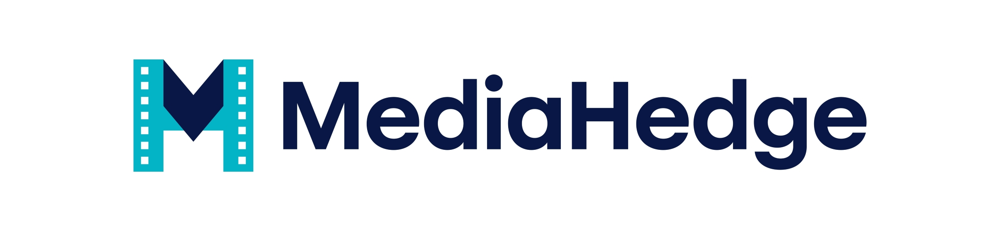
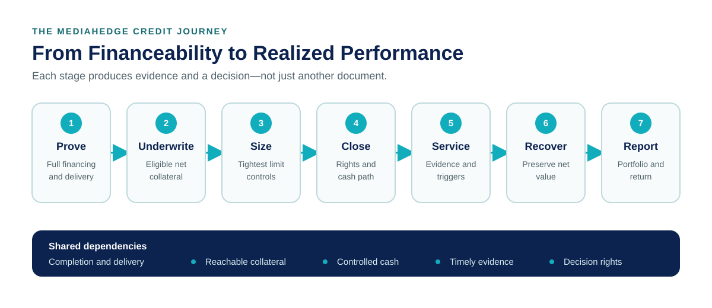

<p align="center">
  
</p>

# MediaHedge Knowledgebase

### Film and Television Finance, Explained as a Credit System

How do you lend against money that may arrive from tax incentives, distribution contracts, controlled accounts, insurance proceeds, or rights that have not yet been sold—while a production is still moving toward completion and delivery?

That is the puzzle this knowledgebase explores.

MediaHedge sits at the intersection of creative production and disciplined credit. This repository turns the company’s film- and television-finance framework into a navigable field guide: how a potential loan becomes financeable, how exposure is sized, how cash and collateral are controlled, how changing risk is monitored, and how a financing partner can evaluate downside and return.

You do not need to be a film-finance specialist. Pick the question that brought you here and follow the trail.

## Choose Your Route

| If You Want To… | Start Here |
| --- | --- |
| Meet MediaHedge and understand its role | [Who MediaHedge Is](wiki/entities/mediahedge.md) |
| Grasp the complete lending model quickly | [How the MediaHedge Lending Model Works](wiki/overview.md) |
| Evaluate the model as a financing partner | [A Financier’s Guide](wiki/syntheses/financier-diligence-route.md) |
| Follow a loan from screening through recovery | [Film-Finance Credit Lifecycle](wiki/syntheses/credit-lifecycle.md) |
| Compare repayment sources and their risks | [Repayment and Risk Map](wiki/syntheses/repayment-and-risk-map.md) |
| Distinguish contracted pre-sales from unsold-rights value | [Pre-Sales Collateral](wiki/concepts/pre-sales-collateral.md) and [Gap Collateral](wiki/concepts/gap-collateral.md) |
| Compare completion, surety, and insurance protection | [Protection Stack](wiki/concepts/protection-stack.md) |
| Understand what the evidence does—and does not—establish | [Evidence and Limitations](wiki/evidence-and-limitations.md) |
| Translate the specialized language | [Plain-English Glossary](wiki/glossary.md) |

For the complete reader map, open the [MediaHedge Knowledgebase home note](MediaHedge%20Knowledgebase.md).

## The Credit Journey



*Conceptual view: each stage produces evidence and a decision. Current policy, approved exceptions, executed documents, and transaction facts still control any specific financing.*

The central idea is simple: film-finance credit is a connected system. A loan is not protected by one document, one repayment source, or one attractive coupon. It depends on a chain of financeability, eligibility, sizing, control, servicing, remedies, and portfolio discipline.

## What You Will Learn

- **Financeability:** why complete sources, uses, timing, contingency, and delivery matter to several repayment paths at once. Start with [Full Financing](wiki/concepts/full-financing.md).
- **Repayment:** how [contracted pre-sales](wiki/concepts/pre-sales-collateral.md), tax incentives, [unsold-rights value](wiki/concepts/gap-collateral.md), insurance proceeds, and controlled cash differ. See the [Repayment and Risk Map](wiki/syntheses/repayment-and-risk-map.md).
- **Exposure:** how eligible value meets advance rates, concentration limits, leverage, budget exposure, term, and liquidity. Follow [Loan Sizing](wiki/concepts/loan-sizing.md).
- **Control:** how security interests, assignments, notices, accounts, and waterfalls make rights operational. Explore [Security Package](wiki/concepts/security-package.md) and [Cash Control and Waterfalls](wiki/concepts/cash-control-and-waterfalls.md).
- **Protection:** why [Completion Protection](wiki/concepts/completion-protection.md), [Surety and Credit Protection](wiki/concepts/surety-credit-protection.md), production insurance, structural cushion, and monitoring address different failure modes. Walk through the [Protection Stack](wiki/concepts/protection-stack.md).
- **Change and downside:** how servicing information becomes action and how recovery options are preserved under stress. Read [Monitoring and Servicing](wiki/concepts/monitoring-and-servicing.md) and [Defaults, Workouts, and Recoveries](wiki/concepts/defaults-workouts-and-recoveries.md).
- **Partnership and performance:** how authority, concentration, cash timing, costs, and losses affect a financing relationship. Continue to [Financing-Partner Governance](wiki/concepts/forward-flow-governance.md), [Portfolio Construction](wiki/concepts/portfolio-construction.md), and [Return Economics](wiki/concepts/financier-return-economics.md).

## Why This Wiki Shows Its Work

This is not a pile of marketing pages. It is designed as a maintained knowledge system.

- **Source-grounded:** durable explanations trace back to preserved source snapshots.
- **Decision-first:** navigation begins with the questions a financing partner is likely to ask.
- **Explicit about uncertainty:** policy status, missing authority, inference, and open questions remain visible.
- **Designed for distinctions:** eligibility is not valuation; cash direction is not account control; insurance is not a completion guaranty; stated coupon is not realized return.
- **Recoverable and auditable:** additive Git history, milestone tags, an independent mirror, and checksum-protected bundles preserve prior generations.

## Explore It in Obsidian

The repository is also a complete Obsidian vault.

1. Clone the repository or use GitHub’s **Download ZIP** option.
2. Open the repository’s `MH Wiki` folder as an Obsidian vault.
3. Begin with [MediaHedge Knowledgebase.md](MediaHedge%20Knowledgebase.md).
4. Follow the internal links by question, concept, or stage of the credit lifecycle.

```powershell
git clone https://github.com/jongos/mh-wiki.git
```

## Repository Map

| Location | What It Contains |
| --- | --- |
| [`wiki/`](wiki/) | Maintained overviews, concepts, entities, syntheses, evidence guidance, and private operations pages |
| [`raw/sources/`](raw/sources/) | Immutable canonical source snapshots |
| [`assets/`](assets/) | The MediaHedge banner and original reader-facing diagrams |
| [`templates/`](templates/) | Structures for creating consistent wiki pages |
| [`tools/`](tools/) | Link, source-integrity, recovery, Publish, and GitHub synchronization checks |
| [`AGENTS.md`](AGENTS.md) | The evidence, maintenance, presentation, and publication contract for AI-assisted work |
| [`VERSION-HISTORY.md`](VERSION-HISTORY.md) | Milestone and recovery guide |

<details>
<summary><strong>Maintaining the Knowledgebase</strong></summary>

Before changing the wiki, read [`AGENTS.md`](AGENTS.md). Preserve manual edits and immutable raw sources, update the append-only activity log, and run the health checks.

```powershell
tools\wiki-lint.cmd
tools\wiki-diagnostics.cmd
tools\github-sync.cmd
```

The GitHub synchronization command refuses dirty trees, unexpected remotes, credential-pattern findings, lint failures, archive failures, and local/remote mismatches.

</details>

## Important Boundaries

This knowledgebase is educational. It explains the framework represented in the available material; it does not approve a transaction, certify current policy, establish enforceability, or replace current legal, tax, insurance, accounting, program, or investment review.

Current approved policy, executed transaction documents, verified performance information, and qualified professional advice control any specific financing decision.

---

*Welcome in. Pick a question, follow the evidence, and see how the controls connect.*
